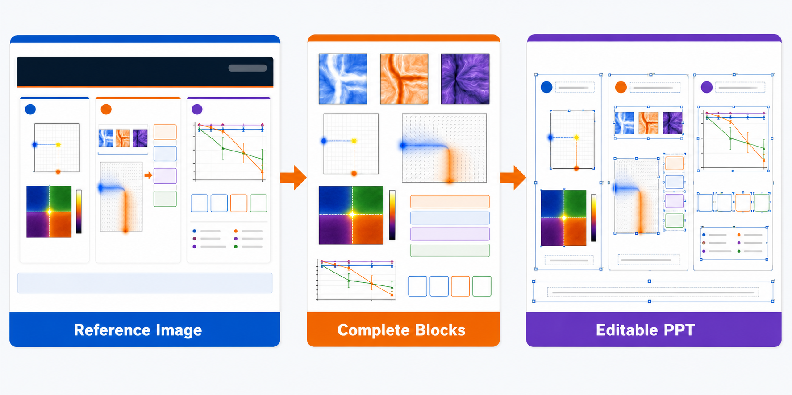
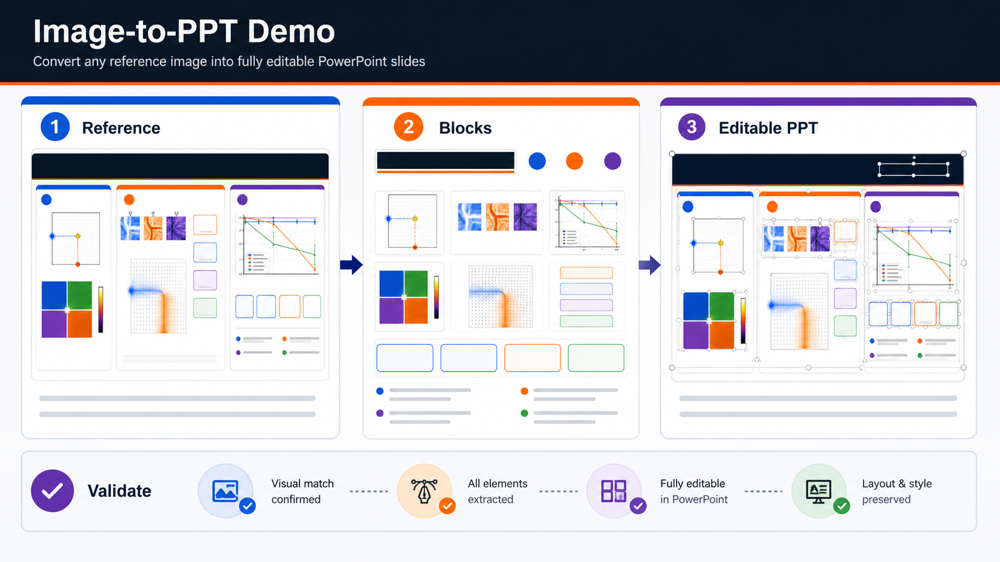
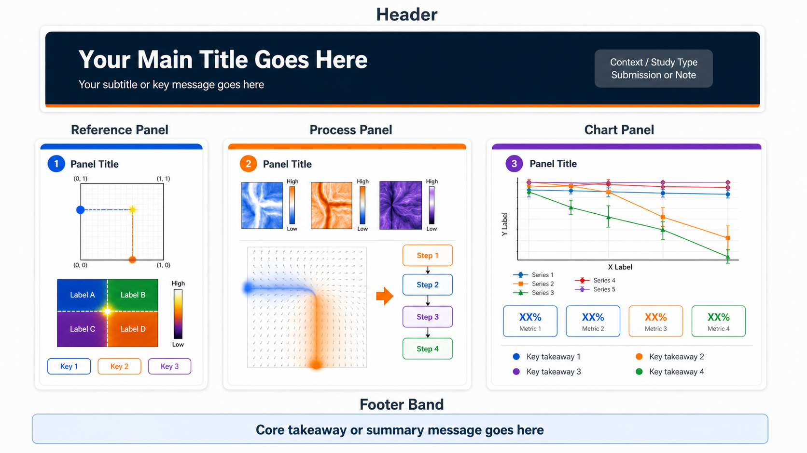
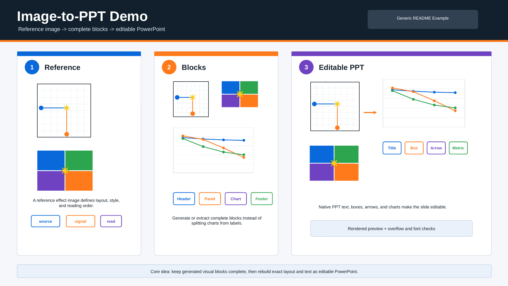

# image-to-ppt-skills

`image-to-ppt-skills` is a Codex skill for turning reference effect images, paper figures, screenshots, or generated image blocks into editable, validated PowerPoint slides. It is designed for academic figures, mechanism diagrams, framework slides, and data-heavy visual summaries where the final output needs both generated visual polish and practical PPT editability.



## What It Does

The skill separates visual art direction from PowerPoint production:

1. Inspect or generate a complete reference effect image.
2. Decompose the design into complete visual blocks, such as headers, panels, charts, metric sections, and footer bands.
3. Generate missing block assets when needed while keeping charts, legends, metrics, captions, and internal labels together.
4. Rebuild the slide in PowerPoint with precise positioning, editable text, native shapes, arrows, boxes, badges, and validation previews.

This skill does not treat PPT generation as a flat screenshot export. Complex visuals can stay rasterized, but layout structure, labels, callouts, and repeated UI elements should be rebuilt with editable PPT primitives when accuracy or later revision matters.

## Default Model Behavior

The skill uses the available image generation path only when raster block assets need to be generated or regenerated.

- Default: use Codex built-in `image_gen` when available.
- If the user requests a specific model or endpoint, check the configured API/CLI path and credentials before use.
- If no image generation model is available, continue with source figures and PPT-native reconstruction when possible; otherwise stop and ask the user to connect an image generation provider.

The skill does not silently separate chart text from chart graphics. By default, generated element sets preserve complete blocks, especially charts with axes, legends, metrics, captions, and labels.

## Example Output

The illustrations below are synthetic demo assets generated for this repository. They do not contain user project data.

Reference effect image:



Generated block assets:



Editable PPT reconstruction preview:



The editable PowerPoint example is available at [`examples/effects/example_editable_slide_generic.pptx`](examples/effects/example_editable_slide_generic.pptx).

## Detailed Process

1. **Reference collection**: locate the effect image, paper PDF, source figures, generated block set, and any previous PPT outputs.
2. **Block planning**: choose a lightweight decomposition level. Typical blocks are header/banner, complete content panels, complete charts, metric sections, and footer/core-message bands.
3. **Block generation**: generate one complete image per block when needed. Prompts must include exact text that belongs inside the block and must instruct the model not to split charts, legends, metrics, or captions.
4. **Contact sheet review**: inspect generated blocks together before using them in PPT.
5. **PPT assembly**: use PptxGenJS to position images, rebuild panels, add editable text, and supplement missing boxes, arrows, legends, or labels.
6. **Validation**: render the `.pptx` to PNG, inspect placement visually, run overflow checks, and detect missing or substituted fonts.
7. **Clean delivery**: provide the `.pptx`, preview PNG, authoring script, and only the assets needed to rebuild the deck.

Typical use cases include:

- recreating a generated slide effect as an editable PowerPoint page
- turning a paper figure into a polished one-slide graphical abstract
- generating complete panel images, then assembling them into a PPT layout
- preserving chart readability while still allowing PPT-level text and shape edits
- producing publication or presentation slides with reproducible preview validation

## Installation

Copy the skill folder into your Codex skills directory:

```bash
mkdir -p "${CODEX_HOME:-$HOME/.codex}/skills"
cp -R image-to-ppt-skills "${CODEX_HOME:-$HOME/.codex}/skills/"
```

Then invoke it as:

```text
Use $image-to-ppt-skills to recreate this reference effect image as an editable PPT slide.
```

## Prompt Pattern

For generated block assets, use prompts like:

```text
Use case: scientific-educational / productivity-visual.
Asset type: Complete PowerPoint panel image element.
Primary request: Generate a complete self-contained panel for an academic PPT slide.
Exact text to render: <verbatim block text>
Visual content: <chart/data/diagram/flow details>
Style: modern academic PPT, crisp readable labels, no watermark, no unrelated logos.
Constraint: Keep this whole block complete as one image element; do not separate charts, legends, metrics, captions, or internal labels.
```

## Repository Layout

```text
SKILL.md                         # Codex skill instructions
agents/openai.yaml               # UI metadata
examples/effects/                # Example workflow images and PPT output
```
